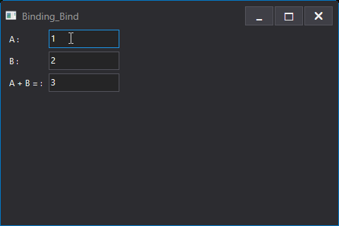

# GacUI：一切的开始

大概是十年前，[我第一次做出了代码编辑器的智能提示](http://www.cppblog.com/vczh/archive/2010/11/07/132876.html)。当时对函数式语言的兴趣很浓厚，就琢磨起怎么实现 generic 和 type class。做完了之后就心痒痒要做个编辑器。那个时候还年轻，精力旺盛，写程序的时候激情四射，自己琢磨了个把月，很快也就把功能实现了。当然比起其他 IDE 那只是个玩具，不过学习编程嘛，就是从挑战这些 big clean problem 中得到进步的。于是我就在想，既然智能提示都做了，那代码折叠要不要做，重构要不要做，等等等等这些功能，要是自己都试一遍，那该多有趣啊。但是摆在面前的问题，就是没有顺手的 UI 库可以用。由于读书的时候试图搞过游戏开发的关系，我也做过简单的 UI 库，于是就想要不就试试吧。UI 库要是做出来了，再用他写一个该 UI 库的开发工具，那人生就进入了一个新的阶段。

10 年之后，终于搞出了 GacUI ( [gaclib.net](http://gaclib.net) )，具有丰富的控件和排版功能，能在 Windows 和 macOS 上跑，换肤无比简单，动画本地化和语言排版手到擒来，还有强大的控件布局、数据绑定以及 MVVM 的功能等等。虽然梦想还没完全实现，但是这一路走来可不简单。

在这之前不久我就已经在做一个[热身项目](http://www.cppblog.com/vczh/archive/2009/08/20/93951.html)。这个项目主要就是画针对 UI 的矢量图。当时就在想，开发 UI 的时候各种布局都要自己写（其实是宇宙第一 WPF 还没深入了解，那年的 CSS 也不适合干这个，其他 UI 库也都很原始），那我能不能把控件的位置和一些属性都写成一个表达式，只要里面的变量内容变了，表达式会自己更新结果然后修改图形，岂不是大大简化了开发？WPF 的 binding 都只能写简单的点点表达式，感觉不太够用。于是就有了这个东西。

想法是很简单的，图元就是一个个的 XML 标记，标记之间可以互相嵌套。我也可以声明一个 template，这个 template 就是一堆图元，只是留下了一些属性让外面配置，用于动态更新里面的表达式，改变显示的内容。有了 template 之后，每一个地方都可以使用这些 template，给不同的属性。现在看起来，这个想法感觉就像 WPF 的 control template，只是各方面都很原始。

```XML
<irconfig>
  <resources> ... </resources>
  <templates>
    <!-- 创建一个 template 名字叫做 background -->
    <template name="background">
      <!-- 给它增加一个 int 属性 x，这个 x 就可以在 template 内部使用 -->
      <property name="x" type="int" default="0"/>
      ...
      <content>
        <something name="client"...>
          <!-- 只要 client.width 或者 x 改了，新的结果就会赋值给 attribute -->
          <another attribute="(client.width - $x) / 2"/>
          ...
        </something>
      </content>
    </template>

    <template name="button">
      <rectangle ...>
        <!-- 在这里创建一个 background 的副本 -->
        <instance reference="background">
          <!-- 修改属性 x，123 也可以是一个表达式 -->
          <setter name="x" value="123"/>
        </instance>
      </rectangle>
    </template>
  </templates>
</irconfig>
```

简单的东西总是很容易就做出来了，虽然后来事实证明，当初还是有点小看了了动态更新表达式结果的算法。我知道有一些基于 JavaScript 的 UI 库，他也想做数据绑定，但是无奈 JavaScript 的编译器却不是集成到工具链里面，于是一个表达式依赖于哪些输入就只能靠猜和轮询，搞得很难看。我出于自我进步而挑战这些问题，又怎么能满足于这种想法呢？

于是整个 UI 架构的雏形开始在脑子里成型。典型的 MVVM，自然就是设计一个界面的时候，他会跟一个 interface 的示例交互。譬如说，点个按钮就会调用该 interface 的函数，函数可能又会动到 interface 的一些属性。界面里面的控件的属性使用到了包含 interface 的属性的表达式，那么 interface 的属性一变，界面就会自动更新。当然数据绑定的机制最好是 universal 的，不仅可以绑定到 interface 的属性，也可以绑定到别的控件的属性，最好这个表达式可以随便你写，而不只局限于一些简单的操作符什么的。

举个[简单的例子](https://github.com/vczh-libraries/Release/blob/master/Tutorial/GacUI_Xml/Binding_Bind/UI/Resource.xml)。一个算加法的程序，需要三个文本框。前两个文本框的内容变了，第三个文本框马上显示两个数字的和：



我们排除布局之类的干扰，只看这三个文本框的话，那GacUI就是这样完成这个任务的：

```XML
<SinglelineTextBox ref.Name="textBoxA" Text="1"/>

<SinglelineTextBox ref.Name="textBoxB" Text="2"/>

<SinglelineTextBox ref.Name="textBoxC" Readonly="true" Text-bind="(cast int textBoxA.Text) + (cast int textBoxB.Text) ?? 'ERROR'"/>
```

首先我们有文本框 textBoxA（初始化1）、textBoxB（初始化2）以及 textBoxC。textBoxC 的 Text 属性是由一个动态更新的表达式构成的：

```
(cast int textBoxA.Text) + (cast int textBoxB.Text) ?? 'ERROR'
```

意思非常直白，在 textBoxA 和 textBoxB 随便哪个被修改之后，我们尝试把文本框的内容 parse 成数字，然后相加。如果输入的不是数字，那就输出 ERROR。

在 GacUI 提供的反射机制中，文本框的 GetText 函数、SetText 函数以及 TextChanged 事件可以被注册到一起成为一个属性。于是编译器就可以轻易得知，为了动态更新这个表达式的结果，textBoxA.TextChanged 和 textBoxB.TextChanged 是需要被挂上 callback 的。在 callback 里面调用这个表达式就好了。

当然具体实现起来比这个要复杂的多。譬如说我是不是可以把（cast int textBoxA.Text）给 cache 起来，这样 textBoxB.TextChanged 里面我可以少做一次 cast，提高程序运行的性能。如果表达式是 F(Foo.Bar.Baz.Value)，Bar 本身也可能会被修改，Baz 本身也可能会被修改。为了监视 Value 的变化，Foo.BarChanged 以及 Foo.Bar.BazChanged 都要被挂 callback。于是在 Foo.BarChanged 里面，Bar 变了 Baz 肯定就变了，我们要把 callback 从旧的 Foo.Bar.BazChanged 以及 Foo.Bar.Baz.ValueChanged 上断开，挂到新的 Foo.Bar.BazChanged 以及 Foo.Bar.Baz.ValueChanged 上面去。为了做到这一点，Foo.Bar 和 Foo.Bar.Baz 天然已经被 cache 起来了，那读 Value 表达式的时候当然要从 cache 的 Baz 对象上面读。后面还有异常处理、函数调用和其他复杂表达式等等各种问题。比 WPF 只能写 Foo.Bar.Baz.Value 那要好用得多了。

如果不绑定到控件属性上，绑定到 ViewModel 的属性上也是一个道理。ViewModel 在窗口初始化的时候传进去，成为了窗口的一个属性。访问 ViewModel 的属性，其实就是在访问窗口的属性的属性的属性等等等，跟访问 textBox 并没有什么不一样。

感觉说的已经比较远了。以前一直有人问我为什么要做 GacUI，这就是我的解答。我打算再接下来的几篇文章中，好好的说一下 GacUI 各种丰富的设计细节的由来以及背后的故事，包括：

- 如何做到跨平台
- 如何实现支持多语言的文字渲染
- 控件与皮肤的架构上的演变
- 各种灵活的布局的设计
- XML 表达的界面是如何跑起来的，以及这些年架构上的演变
- 脚本里面类似 C# 的 yield 和 await 是如何实现的
- 等等

虽然我鼓励用户只把 UI 特效放进 XML，用户逻辑放进 ViewModel 便于测试，但是特效本身可能就需要很多代码。因此我给 GacUI 专门设计了一个跟 C++ 对象交互的脚本语言。虽然这个脚本语言可以依赖反射的特性直接运行，但是为了给用户提供一个去掉反射的选项（反射占用的资源实在太大），我把 XML 整个编译成了这个脚本，再把这个脚本编译成了 C++，于是跑起来的时候没有任何额外负担，Release 模式下丝般顺滑，一个界面放一大堆 table，table 里放几千个 cell 都感觉不到延迟。

曾经有个人使用 GacUI 做了一个[包含下载界面的程序](http://www.gaclib.net/resources/majorav/image_006.png)，下载进度条就是一大堆方块（中年人可能会很熟悉哈哈哈）。我发现用户经常用各种出乎我意料的方法使用 GacUI，我就问他这么多东西怎么搞的，是通过 D2DElement 拿到设备对象自己画的吗？他说不是，就是带了几千个格子的 table。我整个人都惊呆了。
