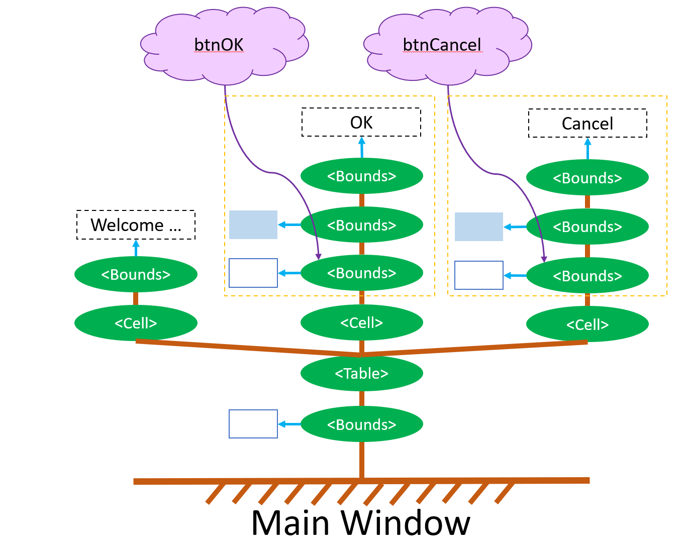

# GacUI：高效的布局系统

> 在本篇博客发布之前，GacUI更新了0.13版本。这个版本的一个重要变化是去掉了对全局鼠标钩子的依赖。以前一直觉得靠全局鼠标钩子来确定什么时候关闭菜单就有点灵车漂移的味道，但是由于要做的事情是在很多，就没把这件事情放在心上。现在GacUI 1.0基本已经完成了（可能还会给ListView做一些增强），在写文档至于，与GacUI爱好者们一起重新审视一些GacUI的实现细节，往往会发现一些需要改进的地方。

把布局系统做的高效其实并没有什么秘密。GacUI的布局系统除了具体的功能以外，只额外关注了“该缓存什么”以及“何时重新计算布局”两件事。

## 布局图元树与控件的关系

上一篇博客涉及到了布局图元树与控件的一些内容，有一些读者反应看得不是很懂。这也是可以理解的，毕竟没有的UI库是这么做的，但是前端的UI库因为DOM的天然存在有可能会比较接近GacUI的做法。再者GacUI XML Resource里面也没有体现出布局图元树与控件的正确关系，反而把布局、图元和控件都在语法上看成是差不多的东西。所以我觉得有必要在这里重新解释一下，而且如果这个问题没有解释清楚，那本篇博客的内容更是无从谈起。

### 布局图元树与DOM-CSS的关系

其实并没有关系，就是打个比方。现在很多程序员都已经熟悉前端开发了，所以对什么是DOM应该已经有了深刻的认识。从某种意义上来说，布局图元树其实跟DOM和CSS是比较类似的。GacUI的布局有相对坐标与绝对坐标对齐、堆栈、浮动元素、表格、跨节点同步尺寸、响应式布局等等内容。GacUI的图元则是一些简单的几何图形和文字等等。放在DOM-CSS的框架里，这就像是大量的`
`，而且每个`
`上面都有CSS。CSS同时具备了布局与图元的功能。

在这里必须吐槽一下，HTML从一个写文章的标记语言发展到现在，功能已经完全偏离了初衷，但是因为HTML、DOM和CSS并没有很好的把不同方面的功能隔离开，导致布局、排版、绘图、抽象数据结构等等一系列的东西都多多少少的被HTML、DOM与CSS同时覆盖，所以学习体验才那么差。

### 控件在布局图元树中的位置

GacUI的一个窗口就是一颗巨大的布局图元树。这棵树只管布局与渲染。如果你用GacUI开发一个跟Word差不多的程序，那么主窗口的这颗布局图元树就会有大量的响应式布局的节点。这些响应式布局的节点在父节点尺寸发生变化的时候，他会自动根据尺寸修改自己的节点下面的子树，就可以实现三个大按钮在收窄了之后变成三个小按钮，再收窄之后文字就没了剩下图标的这种功能。

如果你用GacUI开发一个带有确定取消按钮的对话框，那么主窗口的这颗布局图元树基本就是要给表格，在表格的最后一行的堆栈里（或者右下角的两个单元格，取决于剩余的部分长什么样子，决定对齐这两个按钮的细节，一般就这两种做法），就会有两个框，框里面有字，分别是确定和取消。

其实你看，GacUI的主窗口在响应尺寸变化的时候，窗口其实根本不需要知道窗口里面到底是什么控件，窗口的眼里就只有这颗布局图元树。尺寸修改了，他就去通知这棵树，把图元的位置重新算一遍就行了。

那控件到底是什么呢？众所周知，控件是用来响应用户输入输出的。但是控件跟排版与渲染并没有任何关系，所以他自然就不在这颗布局图元树里。但是控件在响应用户的输入输出的时候得修改这棵树的内容，譬如说替换一下文字啊，修改一下颜色啊等等。所以控件实际上是在管理布局图元树的几个图元的内容，他并不在这棵树里面。

譬如说按钮，一个最简单的按钮控件的皮肤，就是边框+背景色+文字。那么显然，这个按钮皮肤在响应用户操作的时候，只要关心这三个图元的属性就可以了。皮肤也会确定图元是如何排版的，但是一旦创建出按钮皮肤的布局图元树，他就把自己加进窗口的这颗大树里面就可以了，不管窗口怎么动，文字都会永远中心对齐。

现在窗口已经跑起来了。用户会用鼠标点击这个按钮，或者操作键盘来触发这个按钮。按钮在收到这些命令之后，需要去管布局吗？显然不需要。它只需要告诉按钮的皮肤发生了什么，按钮的皮肤就会去修改边框和背景的颜色，或者里面的文字。按钮只需要知道这颗布局图元树的根节点在哪里就好了，毕竟资源之间有依赖关系，如果你把按钮给`delete`了，按钮还是要把皮肤给`delete`了。

所以整个窗口其实就只有布局图元树，而控件，例如这些按钮们，只是在控制这棵树上的一些图元。在GacUI里面你也会觉得控件也是一棵树，因为还有“父控件”与“子控件”属性。不过这个属性完全是通过控件们引用的布局图元树的子树们的根节点之间的位置关系计算出来的，便于编程的时候访问。控件其实根本不会去管子控件的死活，只会在自己被`delete`的时候把这些东西也全都`delete`了。

### 布局图元树与控件的直观想象

如果你要把布局图元树和控件直观的想象出来的话，这其实很简单。布局图元树就是一棵树，相信程序员们都深刻的理解了什么是树。这棵树长在窗口上。而控件则是漂浮在空气中的一些云，每一朵云（每一个控件）有一根细丝连着树上的一根树枝。布局树接受了用户的鼠标和键盘操作，会通过这跟细丝反馈给控件。控件解读用户的行为，把他转变成抽象的语义上的操作（譬如Tab会把“对着某个布局的范围按了一下鼠标“处理成”翻到另一个TabPage”），然后再通过这跟细丝改变图元上的颜色和文字（譬如“把被选中的TabPage的标签弄得更亮”）。

在GacUI的代码中，控件会有指向布局图元树的子树的指针，被指的子树他也有一个反向的指针，这就是树枝上挂着云的那跟细丝。这就是“控件并不在布局图元树里，控件与布局是两个层次的概念”的意思。

在这幅图中，不用的颜色代表不同性质的关系。

- 绿色的椭圆就是布局，布局与布局的关系是一对多的关系，为褐色
- 从布局触发的蓝色的箭头指向的是图元。图元与布局的依附关系是一对一的，这个布局节点决定了图元的绘制范围
- 控件（云）指向布局的箭头是紫色的，指向了由黄色的虚线框起来的子树。控件接受来自子树范围内的鼠标键盘信息，更新子树范围内的图元。

很显然，控件与布局的确是两个不同层次的概念。而只有让布局变得纯粹，不受到控件等多于信息的干扰，才使得接下来的内容实现起来灵活、简洁且解耦。

## 触发重新布局的计算

UI库的一个重要内容就是刷新。在典型的渲染器实现里面，刷新就是把整个窗口重新画一遍。在很久以前UI还需要考虑脏矩形等细节问题，现在已经不需要了。把控件和布局图元树分开还有另一个好处，就是刷新的触发机制变得很简单。

按钮在被鼠标左键点下之后，会告诉按钮的皮肤他的状态切换成了Pressed，而按钮的皮肤对Pressed的解释就是把某个背景颜色改了。背景色作为一个图元，他当然是知道改颜色需要刷新UI的，于是UI的刷新标记就挂上去了。而如果用古典的方法开发UI库的话，就变成按钮需要知道他被按下了之后要刷新UI，然后等者被调用Paint函数，这不仅很罗嗦，而且还很容易漏掉，导致出bug。除了图元被修改以外，布局被修改也是需要刷新UI的。把一个节点换一颗树挂上去，或者改变了一些对齐的设置，基本都会触发UI刷新。

而另一个好处则在列表控件上体现了出来。对于大部分列表来说，一个被滚动条滚到了控件外面的列表项的文字改了，是不需要刷新UI的。因为他看不见。GacUI的列表控件默认都是virtual模式（Win32术语）的，也就是说，看不见的那些列表项是不会浪费布局图元树的资源的。所以列表在发现某个列表项被改掉的时候，他要做的就是，看一下列表项对应的布局图元子树是不是存在，存在就改一下文字，不存在就算了。正是这一直观的流程使得列表对于“什么时候不需要刷新”也自然而然地完成了。

## 缓存布局内容
